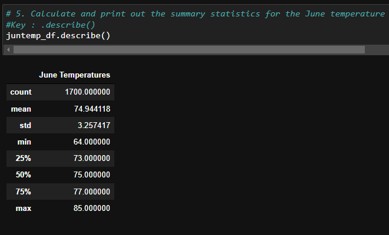
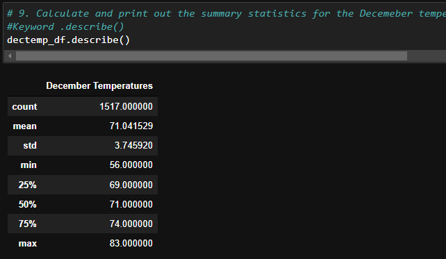
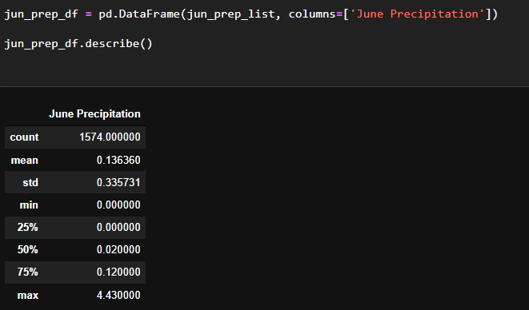
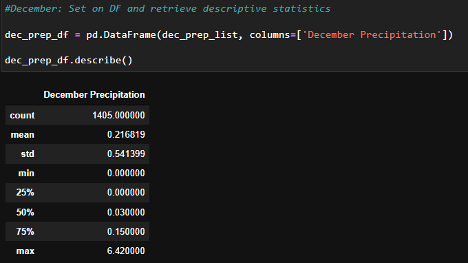

# Surfs Up

## Overview of the Analysis

The purpose of the analysis was to obtain a clearer view of weather conditions in Oahu, Hawaii, to support decision making to investors. Weather is in many cases an important factor that could have a positive or negative impact on different shops and facilities, like those involving outdoor activities, or outdoor related activities, like surfing, and ice cream shops.

For this, an overview of weather was gathered using different tools, making queries of weather information, retrieving, collecting, cleaning and setting it into list and data frames to work with and finally analysed with descriptive statistics to compare different months weather information and obtain a clearer view of weather behaviour that could be a key component when investing in new shops and facilities. 

Used languages and tools: Python, Jupyter Notebook, VS Code, and GitHub, SQLLite

Two months were selected June and December as milestones that could show the highest variation in temperature and thus influence in shop success along the season. 

## Results

As shown in the following Images, June Temperatures and December Temperatures were obtained in the final analysis. 

June Temperatures mean was around 75 ℉ (74.944 ℉), with minimum readings of 64.00 and max of 85.00; reported standard deviation was 3.257. 

December Temperatures mean was around 71 ℉ (71.0415), with min readings of 56,00 and max of 83.00 and a standard deviation of 3.746. 

### Key differences in weather between June and December:

- There’s a 3.9 degree difference between June and December
Average temperatures reported on average 75 ℉ for June and 71 ℉ for December. Meaning its lower in December by 3.9 ℉. 

- Variation in temperatures max and min show that there’s a higher variation in December than in June. 

- Max differences: there’s only 2 degrees of difference between June and December. 

- Min differences: there’s an 8-degree difference between June and December. 

- Standard deviation was 3.2 for June and 3.7 for December meaning there’s more variance in December than June. 

To know if this numbers are statistically significant, further mean and variance analysis would be needed, however knowing the behaviour alone of this may help elucidate behaviour during different seasons as well as the impact it could uphold in business. 

To have a sharper understanding of weather behaviour, two more queries are recommended covering the 2 missing seasons representative months and weather precipitation. As definition weather precipitation includes all forms of water falling out of the sky, be it rain drizzle, snow, sleet, or hail. Rain, the most common would be considered to have a big impact on good weather out door related business as surfing and ice cream. 
The results of this queries are seen below.  
 

-There seem to be more precipitation in December (0.2) than June (0.1), Max levels of precipitation seem to be also higher on December (6.4) than June (4.3)

## Summary
As seen in the following analysis of information retrieved from weather website (gohawaii), despite there seem to be a 3-to-4-degree difference between June and December as well as a difference in precipitation, the overall behaviour of weather seem to be good for business investment. There is not a highly contrasting seasonal change overall the year. 

The tropical weather stability that seem to be occurring wouldn’t limit the business as seasons change according to 2 extreme seasons as are June and December. 

Its important to notice only semestral analysis was made and perhaps a further detailed analysis in other seasons or months could throw a more representative understanding of this place and business feasibility.
Not to mention weather is barely one variable of a multi variable phenomenal that successful business might uphold. 

There’s other elements that could influence Surfing activities like natural disasters, or even human related behaviour like high travel demand vs. low tourist seasons that could have a big impact, not to mention other more specific parameters like perhaps in case of the ice cream, the type, maintenance in the heat or acquisition of supplies or even market likes or dislikes in flavours. 

A good deep business proposal would be highly recommended in order to decide if investment would be desirable or not.
